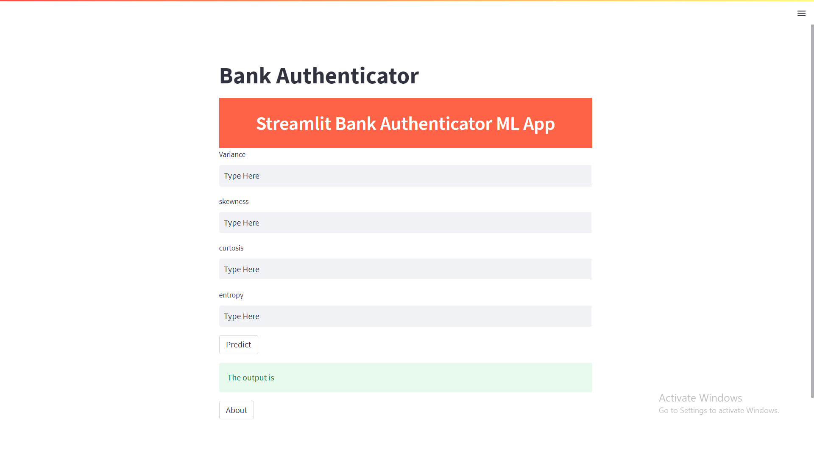

# Bank-Note-Authentication
Bank Note Authentication website based on Random Forest Classifier, Streamlit and HTML

## Motivation
This website strives to reliably identify fake notes. To do so, a collection of photos from real and fake banknote-like specimens is produced. The photos are processed to extract features including wavelet variance, wavelet skewness, wavelet kurtosis, and image entropy.

## Information about Extracted Data
Images acquired from fake and real banknote-like specimens were used to extract data. An industrial camera typically utilized for print inspection was employed for digitization. 400 × 400 pixels. Grayscale images with a resolution of around 660 dpi were obtained, but this depends on the object lens and the distance to the item under investigation. In order to extract features from photos, the Wavelet Transform tool was employed.

## How to use?
Run streamlit run streamlit_app.py command in cmd after downloading codes which will redirect you to the website.

## Contribute 👨‍👨‍👧‍👦
Thanks for taking the time to contribute!

The following is a set of guidelines for contributing to Bank Note Authentication. These are just guidelines, not rules, so use your best judgement and feel free to propose changes to this document in a pull request.

### Pull Requests

Pull Requests are always welcome.
